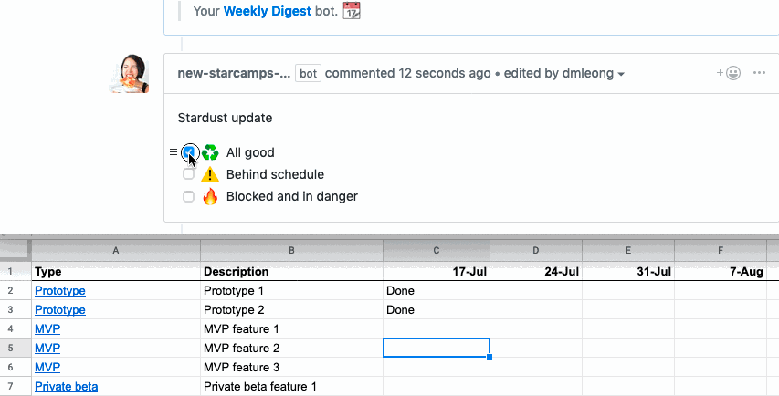

# probot-weekly-radar

> A GitHub App built with [Probot](https://github.com/probot/probot) that updates spreadsheets based on status update comments

## Demo



## History

Lessons learned in a [tweet thread](https://twitter.com/tsunamino/status/1157847680141254657)

## Setup

```sh
# Install dependencies
npm install

# Run the bot
npm start
```
## Google sheets API creds

Most documentation is very hard to read. I recommend [this tutorial](https://www.twilio.com/blog/2017/03/google-spreadsheets-and-javascriptnode-js.html)


## Contributing

If you have suggestions for how probot-weekly-radar could be improved, or want to report a bug, open an issue! We'd love all and any contributions.

For more, check out the [Contributing Guide](CONTRIBUTING.md).

## License

[ISC](LICENSE) © 2019 @dmleong
